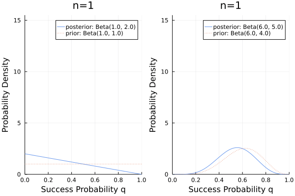
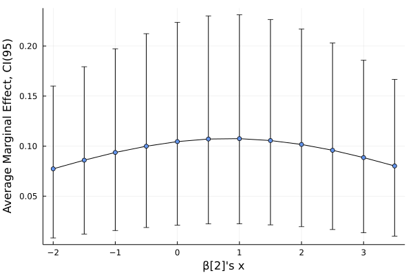
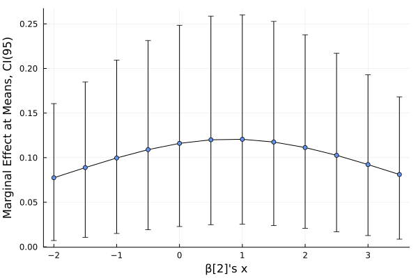

# 中妻照推 (2019)「Pythonによるベイズ統計学入門」朝倉書店出版 with Julia

ベイズとJuliaの勉強用。PPLはPyMCの代わりに[Turing.jl](https://turing.ml/stable/)を使う。

第5章、第6章は未完成。

## 一般化線形モデルの限界効果 (Marginal Effect of Generalized Linear Model)

ロジット回帰、プロビット回帰で推定された係数をそのまま解釈することは、通常、意味を持たない。そこで、限界効果の算出及びmargins plotを実装した (説明変数が連続変数の場合のみ) 。

$\bm{X}$を$(n \times k)$の説明変数行列、$\bm{\beta}$を$k$次元係数ベクトルとすると、ロジット回帰とプロビット回帰の限界効果は以下のように導出される。($\phi(\cdot)$は標準正規確率密度関数)

ロジット回帰
$$
    \frac{\partial Pr(Y=1|\bm{X})}{\partial X_j} = \frac{\exp(\bm{X}\bm{\beta})}{[1+\exp(\bm{X}\bm{\beta})]^2} \beta_j
$$

プロビット回帰
$$
    \frac{\partial Pr(Y=1|\bm{X})}{\partial X_j} = \phi(\bm{X}\bm{\beta})\beta_j
$$

Turingでサンプリングされた$\bm{\beta}$の乱数系列をそれぞれ限界効果の式に代入する。random drawした数だけ限界効果の乱数系列が生成され、限界効果の事後分布が得られる。

限界効果は$\bm{X}$に依存するので、あとは、$\bm{X}$の値を決めてあげれば、お望みの(条件付)限界効果が得られる(at meansなど)。もしくは、全サンプルの平均(Average Marginal Effect: AME)。

